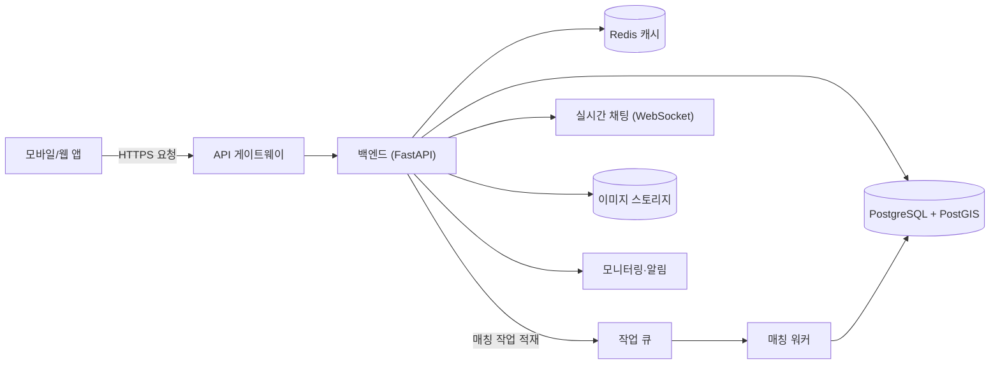

# 동네 반려견 산책 메이트 매칭 앱

> 동네 반려견 산책 메이트 매칭 앱

**가정한 스택**: frontend=React + TypeScript, backend=Python / FastAPI, db=PostgreSQL, auth=JWT(Access/Refresh) + Bcrypt + AES-256

## 1.1 서비스 개요

반경 2km 내의 검증된 견주를 매칭해 **함께 산책할 동행(메이트)**을 연결하는 위치 기반 앱이다. 타깃은 산책 시간이 부족하거나 강아지 사회화·안전을 원하는 1인 가구·맞벌이 견주. 핵심 가치는 "안전한 동행 + 강아지 사회화"이며, 신뢰(견주 검증·평점)와 위치 프라이버시(정확 좌표 비노출)가 제품의 사활을 가른다.
**핵심 가정**: ① 도심 밀집 지역(반경 2km에 충분한 사용자 풀)부터 시작한다. ② 매칭은 실시간이 아니라 "요청→수락"의 비동기 모델(노쇼·안전 검토 시간 확보). ③ 첫 만남은 공개 장소를 강제한다.

## 1.2 일반 사용자 흐름

| 단계 | 동작 | 시니어 설계 포인트 |
|---|---|---|
| 1 | 가입·강아지 프로필 등록(견종/크기/성향) | 위치는 **그리드 근사화**(±300m)로 저장 — 정확 좌표 미노출 |
| 2 | 지도에서 반경 내 메이트 탐색 | PostGIS 공간쿼리 + Redis 캐싱(동일 그리드 60s TTL) |
| 3 | 산책 메이트 **요청 전송** | **비동기**: `202 + jobId` → 후보 적합도 계산(거리·시간대·견종 궁합) 워커 처리, 진행률 노출 |
| 4 | 상대 수락 → 채팅·일정 확정 | WebSocket 채팅, 첫 만남은 **공개 장소 목록**에서만 선택 가능 |
| 5 | 산책 완료 → 상호 평점·후기 | 노쇼 신고 시 즉시 차단 큐로. 부분 실패(후기 저장 실패)는 산책 기록은 보존하고 후기만 재시도 |

## 1.3 관리자 흐름

| 영역 | 핵심 기능 | 관리 요소 |
|---|---|---|
| 사용자 관리 | 견주 검증(신분/반려동물 등록증), 상태 조회·제재 | 미검증→검증→정지/영구차단 상태 전이, 사유 로그 |
| 콘텐츠 모니터링 | 신고·후기·채팅 신고 처리 | 자동 필터(욕설/연락처 강요) + 수동 검토 큐 |
| 시스템 제어 | 매칭 파라미터(반경·적합도 가중치) 조정, 프롬프트/정책 버전 | 변경 이력·롤백 |
| 결제/사용량 | 프리미엄 구독(무제한 요청·우선 노출) 관리 | 구독 상태·환불·사용량 대시보드 |
| 운영 모니터링 | 매칭 성공률·노쇼율·신고율 지표 | 임계 초과 시 알림(노쇼율 > 15%) |

## 1.4 DB 주요 구조

| 테이블 | 주요 필드(PK·FK) | 관계 |
|---|---|---|
| users | id(PK), email(UNIQUE), password_hash, phone_enc(AES), status, deleted_at | 1:N dogs |
| dogs | id(PK), user_id(FK), name, breed, size, temperament | N:1 users |
| walk_requests | id(PK), requester_id(FK), grid_cell(idx), time_slot, status, deleted_at | 1:N matches |
| matches | id(PK), request_id(FK), mate_id(FK), state, meeting_place_id | N:1 walk_requests |
| messages | id(PK), match_id(FK), sender_id(FK), body, created_at(idx) | N:1 matches |
| reviews | id(PK), match_id(FK), rater_id(FK), score, comment, is_latest | N:1 matches |
| reports | id(PK), target_user_id(FK), reason, status | — |
| subscriptions | id(PK), user_id(FK), plan, period_end | N:1 users |
| usage_logs | id(PK), user_id(FK), action, created_at | (가명화 보관) |

- **인덱스**: `walk_requests(grid_cell, time_slot)` 복합(탐색 핫패스), `messages(match_id, created_at)`, GiST 공간 인덱스(PostGIS). **제약**: `users.email` UNIQUE, 모든 FK ON DELETE 정책 명시, `reviews(match_id, rater_id)` UNIQUE(중복 평점 차단).
- **대용량**: `messages`·`usage_logs`는 월 단위 파티셔닝, 12개월 경과분 콜드 스토리지 아카이빙.

## 1.5 보안 처리 방식

| 위협 | 대응 |
|---|---|
| 비밀번호 유출 | Bcrypt(cost 12) 해싱, 평문 미저장 |
| 민감정보(전화·정확위치) 노출 | AES-256 컬럼 암호화, 위치는 그리드 근사화 후 저장 |
| XSS | 채팅·후기 입력 출력 시 Sanitization(허용 태그 화이트리스트) |
| SQL Injection | ORM/Prepared Statement, 원시 쿼리 금지 |
| 토큰 탈취 | Refresh는 HttpOnly+Secure 쿠키·회전, Access는 메모리 보관 |
| **위치 프라이버시(고유 위협)** | 정확 GPS는 서버에만, 클라이언트엔 그리드 중심만 반환. 매칭 확정 전까지 상대 정확 위치 비공개 |
| **노쇼·스토킹(고유 위협)** | 첫 만남 공개 장소 강제, 신고 1회로 즉시 차단 큐, 동일인 재요청 차단 |

## 1.6 개인정보 법령 검토 (한국 개인정보보호법 + 위치정보법)

- **수집(최소수집)**: 이메일·전화(본인확인), 강아지 정보, **위치정보(필수, 근사화 저장)**. 위치는 「위치정보의 보호 및 이용 등에 관한 법률」상 **별도 동의** 분리.
- **보관·파기(조건 분리)**: 원칙적으로 탈퇴 시 즉시 파기·익명화. 단 ①결제·환불 기록은 전자상거래법상 5년, ②신고/분쟁 기록은 분쟁 해결 목적 보관 후 파기.
- **고지·동의**: 필수 동의(서비스 운영·위치)와 선택 동의(마케팅 알림)를 분리, 미동의 시에도 핵심 기능(매칭) 이용에 불이익 없음. 민감정보는 수집하지 않음.

## 2단계 API 명세서

| 기능 | 메서드 | Endpoint | Request Body | Response | 인증 |
|---|---|---|---|---|---|
| 로그인 | POST | `/api/v1/auth/login` | `{email, password}` | `{accessToken, refreshToken}` | - |
| 토큰 갱신 | POST | `/api/v1/auth/refresh` | (쿠키) | `{accessToken}` | - |
| 메이트 탐색 | GET | `/api/v1/mates?cell=&slot=` | - | `{items, total, page}` | ✓ |
| 산책 요청(비동기) | POST | `/api/v1/walk-requests` | `{dogId, timeSlot, radiusKm}` | `202 {jobId}` | ✓ |
| 요청 상태 조회 | GET | `/api/v1/walk-requests/{id}/jobs/{jid}` | - | `{status, matches[]}` | ✓ |
| 매칭 수락 | POST | `/api/v1/matches/{id}/accept` | `{meetingPlaceId}` | `{state:"confirmed"}` | ✓ |
| 신고 | POST | `/api/v1/reports` | `{targetUserId, reason}` | `201 {id}` | ✓ |

**샘플 — 산책 요청**
요청: `POST /api/v1/walk-requests` `{"dogId": 12, "timeSlot": "2026-06-14T18:00+09:00", "radiusKm": 2}`
응답: `202 Accepted` `{"jobId": 8841, "statusUrl": "/api/v1/walk-requests/55/jobs/8841"}`

**공통 에러**: `{"error":{"code":"...","message":"..."}}` · 상태코드 400/401/403/404/429/500. 목록은 `{items,total,page}` 페이지네이션, 분당 요청 레이트 리밋(429 + `Retry-After`).

## 3단계 시스템 아키텍처

**데이터 흐름**: 클라이언트 요청은 게이트웨이를 거쳐 FastAPI로 들어온다. 탐색은 PostGIS 공간쿼리(+Redis 캐싱)로 동기 처리하고, 무거운 매칭 적합도 계산은 작업 큐에 적재해 워커가 비동기 처리한 뒤 결과를 DB에 기록한다. 확정된 매칭의 대화는 WebSocket으로 실시간 전달하고, 모든 지표는 모니터링으로 흘려 임계 초과 시 알림한다.

## 4단계 CRUD 매핑

| 엔티티 | 동작 | 메서드 | Endpoint | 설명 |
|---|---|---|---|---|
| dog | Create | POST | `/api/v1/dogs` | 강아지 프로필 등록 |
| dog | Read | GET | `/api/v1/dogs/{id}` | 조회 |
| dog | Update | PATCH | `/api/v1/dogs/{id}` | 성향·사진 수정 |
| dog | Delete | DELETE | `/api/v1/dogs/{id}` | Soft Delete(deleted_at) |
| match | Create | (Worker) | — | 워커가 적합도 통과 후보로 생성 |
| review | Create | POST | `/api/v1/reviews` | 산책 후 평점·후기 |

## 5단계 비기능 요구사항 (NFR/SLO)

| 항목 | 목표값 | 측정·근거 |
|---|---|---|
| 메이트 탐색 API 지연 | p95 < 300ms | 지도 인터랙션 체감 한계. PostGIS+Redis 캐싱 전제 |
| 매칭 작업 완료 | p95 < 5s(비동기) | 워커 큐 적체 시 진행률로 대기 UX 흡수 |
| 가용성 | 99.9% (월 다운타임 ≤ 43분) | 단일 리전 + 다중 인스턴스 |
| 확장 목표 | 동시 5,000 / 일 50,000 요청 | 병목: 공간쿼리 → 캐싱·읽기복제로 분산 |
| 채팅 전달 지연 | p95 < 1s | WebSocket, 메시지 영속화는 비동기 |

## 6단계 테스트 전략

| 레이어 | 대상 | 기법·도구 | 합격 기준 |
|---|---|---|---|
| 단위 | 적합도 계산·그리드 근사화 | pytest, 경계값 | 거리·시간대·궁합 가중치 정확, 좌표 정밀도 미노출 |
| 통합 | 요청→워커→매칭 파이프라인 | 인메모리 큐 + Fake 외부 | 비동기 흐름·부분 실패 보존 검증 |
| E2E | 가입→탐색→요청→수락→채팅 | Playwright | 핵심 시나리오 + 적대(미검증 사용자 차단) |
| 보안 | 위치 노출·권한 | 스냅샷·인가 테스트 | 정확 좌표가 응답에 절대 미포함 |

CI 게이트: 테스트 통과 + 커버리지 ≥ 75%(핵심 도메인 ≥ 90%) + 린트, 미달 시 머지 차단. 외부 의존성(지도·푸시)은 목/스텁.

## 7단계 배포·운영·관측성

- **환경**: dev / staging / prod 분리, 시크릿은 비밀관리자(.env 금지). **CI/CD**: 빌드→테스트→이미지→스테이징 자동배포→승인→프로드. **배포 전략**: 카나리 10%→100%, 오류율 임계 초과 시 자동 롤백.

| 신호 | 무엇을 | 임계·알림 |
|---|---|---|
| 로그 | 구조화 JSON, 위치·연락처 **마스킹** | ERROR 급증 시 알림 |
| 지표(SLI) | 탐색 p95, 매칭 성공률, 노쇼율 | p95 > 300ms 또는 노쇼율 > 15% |
| 추적 | 요청→워커 분산 추적 | 큐 적체 > 1분 |
| 헬스체크 | `/health`, 워커 하트비트 | 실패 시 자동 재기동·런북 |

용량/비용: 초기 단일 리전 2~3 인스턴스 + 매니지드 PostgreSQL/Redis 기준 월 추정 소규모. 트래픽 증가 시 읽기 복제·캐시 우선 확장.

## 8단계 리스크·가정·MVP 로드맵

**핵심 가정**: 도심 밀집 지역에 매칭 가능한 사용자 풀이 형성된다(아니면 매칭이 안 됨 = 콜드스타트 문제).

| 리스크 | 영향 | 완화책 |
|---|---|---|
| 콜드스타트(초기 사용자 부족) | 매칭 실패→이탈 | 지역 1곳 집중 런칭, 초기 산책 모임 시딩 |
| 안전 사고·스토킹 | 신뢰 붕괴·법적 책임 | 견주 검증, 공개장소 강제, 즉시 차단, 신고 SLA |
| 위치 프라이버시 유출 | 법 위반·평판 | 근사화 저장, 정확좌표 서버한정, 정기 점검 |
| 노쇼 | 경험 악화 | 평점·노쇼율 패널티, 반복 시 제한 |

**오픈 이슈**: 견주 검증 수준(서류 vs 본인인증 연계), 결제 모델(구독 vs 건당), 사고 시 책임·보험.

| Phase | 포함 기능 | 목표 |
|---|---|---|
| MVP | 프로필·탐색·요청/수락·채팅·신고 | 한 지역에서 매칭이 실제로 성사되는지 검증 |
| v1 | 평점·검증 배지·공개장소·노쇼 패널티 | 신뢰·안전 확보 |
| v2 | 프리미엄 구독·우선노출·산책 그룹 | 수익화 |
