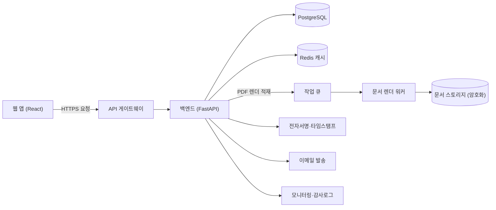

# 프리랜서 계약서 자동 생성 SaaS

> 프리랜서 계약서 자동 생성 SaaS

**가정한 스택**: frontend=React + TypeScript, backend=Python / FastAPI, db=PostgreSQL, auth=JWT(Access/Refresh) + Bcrypt + AES-256

## 1.1 서비스 개요

프리랜서·클라이언트가 **몇 가지 항목만 입력하면 법적 효력 있는 계약서를 자동 생성·전자서명·보관**하는 SaaS다. 타깃은 표준계약서 작성이 부담스러운 1인 프리랜서·소규모 에이전시. 핵심 가치는 "분쟁을 예방하는 계약을 5분 만에"이며, **법적 정확성(검수된 템플릿)**과 **서명의 법적 효력(전자서명·타임스탬프·감사추적)**이 제품의 사활을 가른다.
**핵심 가정**: ① 변호사 검수를 거친 템플릿 세트를 제공(서비스가 법률자문을 하지는 않음 — 면책 고지). ② 1차 시장은 한국, 표준하도급·용역 계약 기준. ③ 서명은 자체 전자서명 + 감사추적(공인전자서명 연계는 v2).

## 1.2 일반 사용자 흐름

| 단계 | 동작 | 시니어 설계 포인트 |
|---|---|---|
| 1 | 템플릿 선택(용역/외주/NDA) | 템플릿은 버전 관리, 생성 시점 버전을 계약에 고정 |
| 2 | 당사자·대금·기간·범위 입력 | 입력 검증(사업자번호·금액·날짜), 임시저장(draft) |
| 3 | **계약서 PDF 생성** | **비동기**: `202 + jobId` → 렌더 워커가 PDF 생성, 진행률 노출. 실패 시 draft 보존 |
| 4 | 상대에게 **서명 요청** 발송 | 서명 링크(만료·1회성 토큰), 알림(이메일). 부분 서명 상태 보존 |
| 5 | 양측 전자서명 완료 | 서명 시 타임스탬프·IP·동의 해시 기록(감사추적), 완료본 잠금 |
| 6 | 보관·다운로드·갱신 | 원본 무결성 해시 저장, 만료 알림, 재계약 복제 |

## 1.3 관리자 흐름

| 영역 | 핵심 기능 | 관리 요소 |
|---|---|---|
| 사용자 관리 | 계정 상태·제재, 본인확인 | 미인증→인증→정지 상태, 사유 로그 |
| 콘텐츠(템플릿) 관리 | 템플릿 등록·검수·버전 | 변호사 검수 상태, 배포 버전·롤백 |
| 시스템 제어 | 서명 정책·만료 설정, 정책 버전 | 변경 이력 |
| 결제/사용량 | 구독·문서당 과금, 환불 | 플랜별 한도·사용량·비용 대시보드 |
| 운영 모니터링 | 생성 실패율·서명 완료율·발송 성공률 | 임계 초과 알림(생성 실패율 > 2%) |

## 1.4 DB 주요 구조

| 테이블 | 주요 필드(PK·FK) | 관계 |
|---|---|---|
| users | id(PK), email(UNIQUE), password_hash, biz_no_enc(AES), status, deleted_at | 1:N contracts |
| templates | id(PK), kind, version, content, is_latest, reviewed_by | 1:N contracts |
| contracts | id(PK), owner_id(FK), template_id(FK), template_version, status, deleted_at | 1:N parties, signatures |
| contract_parties | id(PK), contract_id(FK), role, name, email, biz_no_enc | N:1 contracts |
| signatures | id(PK), contract_id(FK), signer_id, signed_at, ip, consent_hash | N:1 contracts |
| documents | id(PK), contract_id(FK), pdf_uri, sha256, version | N:1 contracts |
| subscriptions | id(PK), user_id(FK), plan, period_end | N:1 users |
| usage_logs | id(PK), user_id(FK), action, created_at | (가명화 보관) |
| audit_logs | id(PK), actor_id, action, target, created_at | (법정 보관) |

- **인덱스**: `contracts(owner_id, status)`, `signatures(contract_id)`, `templates(kind, is_latest)`. **제약**: `users.email` UNIQUE, `documents.sha256` 무결성, FK NOT NULL·삭제 정책 명시. 완료된 계약은 **불변(immutable)** — UPDATE 금지, 변경은 새 버전.
- **대용량/보존**: `audit_logs`·`documents`는 변경 불가 보관(WORM 성격), 법정 기간 후 파기 잡 분리.

## 1.5 보안 처리 방식

| 위협 | 대응 |
|---|---|
| 비밀번호 유출 | Bcrypt(cost 12) |
| 민감정보(사업자번호·계약금액·서명) 노출 | AES-256 컬럼 암호화, PDF는 서명 URL(만료·서명) 기반 접근 |
| XSS | 입력(당사자명·특약) 출력 Sanitization |
| SQL Injection | ORM/Prepared Statement |
| 토큰 탈취 | Refresh HttpOnly+Secure·회전, Access 메모리 |
| **서명 위·변조(고유 위협)** | 완료본 SHA-256 무결성 해시, 서명 시 타임스탬프·IP·동의 해시 감사추적, 완료 후 불변 잠금 |
| **무권한 계약 열람(고유 위협)** | 계약 단위 ACL(소유자·당사자만), 서명 링크는 1회성·만료 토큰 |

## 1.6 개인정보 법령 검토 (한국 개인정보보호법 + 전자문서·전자거래기본법)

- **수집(최소수집)**: 이메일·이름·사업자번호(계약 당사자 식별), 서명 메타데이터(IP·시각). 계약 본문의 금융정보는 거래 목적.
- **보관·파기(조건 분리)**: 원칙적으로 탈퇴 시 즉시 파기. 단 ①체결된 계약·전자문서는 전자문서법·상법상 보존 의무 기간 보관 후 파기, ②결제 기록은 전자상거래법 5년. **법적 보관 의무가 즉시 파기와 충돌하지 않도록** 계약 문서는 익명화가 아니라 보존 대상으로 분리.
- **고지·동의**: 전자서명 효력·보관 기간을 명확히 고지. **면책 고지 필수**: 본 서비스는 템플릿 제공이며 개별 법률자문이 아님. 마케팅 동의는 선택 분리.

## 2단계 API 명세서

| 기능 | 메서드 | Endpoint | Request Body | Response | 인증 |
|---|---|---|---|---|---|
| 로그인 | POST | `/api/v1/auth/login` | `{email, password}` | `{accessToken, refreshToken}` | - |
| 템플릿 목록 | GET | `/api/v1/templates?kind=` | - | `{items, total, page}` | ✓ |
| 계약 초안 생성 | POST | `/api/v1/contracts` | `{templateId, parties[], terms{}}` | `201 {id, status:"draft"}` | ✓ |
| PDF 생성(비동기) | POST | `/api/v1/contracts/{id}/render` | - | `202 {jobId}` | ✓ |
| 렌더 상태 조회 | GET | `/api/v1/contracts/{id}/jobs/{jid}` | - | `{status, pdfUrl}` | ✓ |
| 서명 요청 발송 | POST | `/api/v1/contracts/{id}/sign-requests` | `{partyEmail}` | `202 {sent:true}` | ✓ |
| 서명 제출 | POST | `/api/v1/sign/{token}` | `{consent:true, signatureImg}` | `{state:"signed"}` | 토큰 |

**샘플 — 계약 초안 생성**
요청: `POST /api/v1/contracts` `{"templateId": 3, "parties": [{"role":"client","email":"c@x.com"},{"role":"freelancer","email":"f@y.com"}], "terms": {"fee": 3000000, "currency":"KRW", "startDate":"2026-07-01", "scope":"웹 리뉴얼"}}`
응답: `201 Created` `{"id": 91, "status": "draft", "templateVersion": "v5"}`

**공통 에러**: `{"error":{"code":"...","message":"..."}}` · 400/401/403/404/429/500. 목록 `{items,total,page}`, 무거운 렌더는 202+jobId, 분당 레이트 리밋(429 + `Retry-After`).

## 3단계 시스템 아키텍처

**데이터 흐름**: 클라이언트가 초안 데이터를 보내면 FastAPI가 검증·저장한다. PDF 생성은 무겁고 실패 가능성이 있어 작업 큐에 적재하고 렌더 워커가 비동기로 생성해 **암호화된 문서 스토리지**에 올린 뒤 무결성 해시를 기록한다. 서명 요청은 이메일로 1회성 링크를 발송하고, 서명 시 타임스탬프·IP·동의 해시를 감사로그에 남긴다.

## 4단계 CRUD 매핑

| 엔티티 | 동작 | 메서드 | Endpoint | 설명 |
|---|---|---|---|---|
| contract | Create | POST | `/api/v1/contracts` | 초안 생성 |
| contract | Read | GET | `/api/v1/contracts/{id}` | 당사자·소유자만 |
| contract | Update | PATCH | `/api/v1/contracts/{id}` | **draft 상태만** 수정, 완료본 불변 |
| contract | Delete | DELETE | `/api/v1/contracts/{id}` | Soft Delete(체결본은 보존 의무로 파기 제외) |
| document | Create | (Worker) | — | 렌더 워커가 PDF 생성·해시 기록 |
| signature | Create | POST | `/api/v1/sign/{token}` | 서명 제출(감사추적) |

## 5단계 비기능 요구사항 (NFR/SLO)

| 항목 | 목표값 | 측정·근거 |
|---|---|---|
| 초안 저장/조회 API | p95 < 250ms | 폼 인터랙션 체감 |
| PDF 생성 완료 | p95 < 8s(비동기) | 템플릿 렌더 + 폰트 임베드. 진행률로 대기 흡수 |
| 가용성 | 99.9% | 서명 가능 시간대 무중단 중요 |
| 확장 목표 | 동시 2,000 / 일 20,000 문서 | 병목: 렌더 워커 → 수평 확장·큐 |
| 문서 무결성 | 100% 해시 검증 통과 | 다운로드 시 sha256 재검증 |

## 6단계 테스트 전략

| 레이어 | 대상 | 기법·도구 | 합격 기준 |
|---|---|---|---|
| 단위 | 입력 검증·금액/날짜·템플릿 치환 | pytest, 경계값 | 잘못된 사업자번호·금액 거부, 치환 누락 0 |
| 통합 | 초안→렌더→해시→서명 파이프라인 | 인메모리 큐 + Fake 서명 | 비동기 흐름·부분 실패(draft 보존) |
| E2E | 생성→발송→양측 서명→완료 | Playwright | 핵심 시나리오 + 만료 토큰 거부 |
| 보안/규정 | 무권한 열람·완료본 불변 | 인가·불변성 테스트 | 타인 계약 403, 완료본 UPDATE 차단 |

CI 게이트: 테스트 통과 + 커버리지 ≥ 80%(계약·서명 도메인 ≥ 90%) + 린트. 외부(서명·메일·PDF 폰트)는 목/스텁, 템플릿 골든 스냅샷 회귀.

## 7단계 배포·운영·관측성

- **환경**: dev/staging/prod, 시크릿·서명키는 비밀관리자(KMS). **CI/CD**: 빌드→테스트→이미지→스테이징→승인→프로드. **배포 전략**: 블루그린(서명 중 세션 끊김 방지), 오류율 임계 초과 시 롤백.

| 신호 | 무엇을 | 임계·알림 |
|---|---|---|
| 로그 | 구조화 JSON, 금액·사업자번호 **마스킹** | ERROR/렌더 실패 급증 |
| 지표(SLI) | 생성 실패율, 서명 완료율, 발송 성공률 | 생성 실패율 > 2% / 메일 실패 > 5% |
| 추적 | 초안→렌더→서명 분산 추적 | 큐 적체 > 2분 |
| 헬스체크 | `/health`, 워커·서명 연동 상태 | 실패 시 자동 재기동·런북 |

용량/비용: 문서 스토리지는 증가 누적형 → 라이프사이클(콜드 전환)로 비용 관리. 렌더 워커는 트래픽 따라 오토스케일.

## 8단계 리스크·가정·MVP 로드맵

**핵심 가정**: 변호사 검수 템플릿으로 "법적 효력 있는 계약"이라는 신뢰를 줄 수 있다(아니면 핵심 가치가 무너짐).

| 리스크 | 영향 | 완화책 |
|---|---|---|
| 법적 효력·책임 분쟁 | 서비스 신뢰·법적 책임 | 변호사 검수 템플릿, **법률자문 아님 면책 고지**, 감사추적 보존 |
| 전자서명 효력 시비 | 계약 무효 주장 | 타임스탬프·IP·동의 해시·무결성 해시, v2 공인전자서명 연계 |
| 문서 유출 | 치명적 신뢰 붕괴·법 위반 | 암호화 저장, 1회성 서명 링크, 계약 단위 ACL |
| 템플릿 오류 | 다수 계약 결함 | 검수 워크플로·버전 고정·골든 스냅샷 회귀 |

**오픈 이슈**: 공인전자서명/본인확인 연계 범위, 해외 당사자(준거법·언어), 과금 모델(구독 vs 문서당), 보험·법적 책임 한계 명문화.

| Phase | 포함 기능 | 목표 |
|---|---|---|
| MVP | 템플릿 1~2종·초안·PDF 생성·자체 전자서명·보관 | "입력→서명 완료본"이 실제로 도는지 검증 |
| v1 | 템플릿 확장·감사추적·만료/갱신 알림·과금 | 신뢰·수익화 |
| v2 | 공인전자서명·본인확인 연계·다국어 | 법적 효력 강화·시장 확대 |
